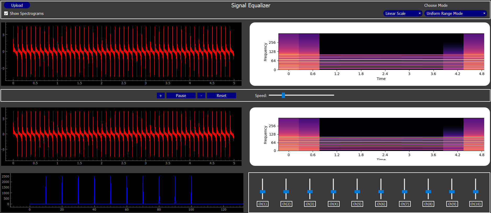

# Signal Equalizer Desktop Application

## Table of Contents
- [Introduction](#introduction)
- [Project Structure](#project-structure)
- [Project Features](#project-features)
- [Getting Started](#getting-started)
- [Team](#team)

## Introduction


Signal Equalizer is a desktop application that equalizes signals in different modes, including uniform range, Music and Vowels, Music and Animal, and Weiner. This application is built using PyQt for the user interface, providing a seamless and interactive experience for users.

## Project Structure
The application is organized as follows:
```bash
master
├─ Data
│  ├─ UniformSignal (csv)
│  ├─ musicAndAnimal (wav)
│  ├─ Music_Mode (wav)
│  ├─ Weiner_Data
│      ├─ song_final_1 (wav)
│      ├─ song_final_2 (wav)
│      ├─ song_final_3 (wav)
│      ├─ filtered_1 (wav)
│      ├─ filtered_2 (wav)
│      ├─ filtered_3 (wav)
├─ equalizer (UI file)
├─ Main.py (Main file)
├─ Mode.py (Mode class)
├─ Signal.py (signal class)
├─ Spec_Widget_New (Spectogram class)
├─ Widget.py (Widget class)
└─ README.md

  ```

## Project Features
The desktop application includes the following features:

- **User Interface**: 
  - Two signal viewers, one for the input and one for the output signals. The two viewers should allow the signals to run in time in a synchronous way (with controls for playing and pausing and speed).
  - Two spectrograms for visualizing input and output signals.
  - A combobox for switching between different modes:
    - **Uniform Range Mode**: Divides the total frequency range of the input signal into 10 equal ranges, each controlled by a slider.
    - **Vowels Mode**: Controls the magnitude of specific vowels based on their frequency components.
    - **Musical Instruments Mode**: Adjusts the magnitude of specific musical instruments in the input signal.
    - **Biological Signal Abnormalities**: Controls the magnitude of specific abnormalities (e.g., ECG arrhythmia) in biological signals.

## Getting Started
To set up the Signal Equalizer desktop application, follow these steps:

1. **Clone the repository**:
   ```bash
   git clone https://github.com/mohamed5841/Signal-Equalizer.git
   
2. **Install Python3**:
   ```bash
     www.python.org/downloads/
  
3. **Install required packages**:
  Open a terminal and run:
   ```bash
   pip install -r requirements.txt

 4.**Run the application**:
 Navigate to the src directory in your terminal and execute:
  ```bash
      python main.py
   ```
## Team
This project was developed as part of the Biomedical Signal Processing class task by the following team members:

| Team Members       | 
|---------------------|
| Mohamed Abdelhamid | 
| Mohamed Salah      | 
| Shaimaa Kamel      | 
| Bassant Rabie      |
| Malak Emad         | 

## Submitted To

| Name           | 
|-----------------|
| Dr. Tamer Basha|

